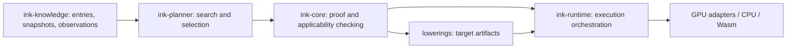

# Repository architecture and data contract

The distribution assembles pinned repositories. The core's source lives entirely in `core/src`; `src/` contains CLI/facade code. Search and physical execution are separate packages rather than database scripts or target-specific bundle logic.

## Immutable data

An entry is `(schema, kind, semantics, dependencies, interface, payload)`. Kinds describe intended use; semantics versions define payload meanings. The interface explicitly records parameter/result sorts, operations, effects and applicability conditions. Canonical sorted JSON determines SHA-256 identity. Names and storage locations are independent of identity and proof authority.

Snapshots pin authenticated trees of entry IDs, not mutable paths or SQL rows. A view exports only selected roots, their exact dependency closure and membership proofs. The checker rechecks every supplied entry and its premises. Queries can page by stable IDs and select by kind, semantics, result/parameter type, operation, effect or condition. Index metadata is checked against typed mathematical payloads before admission.

SQLite stores rebuildable discovery tables and membership witnesses. Indexed subset export authenticates each witness against the pinned root and reads only selected object files. Index construction scans canonical objects; normal query/export does not need to parse the entire database. Index corruption can prevent discovery, but cannot turn invalid mathematics into accepted evidence. A hosted DB can implement the same object/view contract without a change to proof authority.

Performance observations are separate immutable objects. Comparisons require exact program/plan, hardware/driver/toolchain/backend/bridge and workload shape/distribution/concurrency/residency provenance. Costs never establish a theorem or applicability premise. Recording an observation does not change the proof snapshot.

## Evidence and replay

Executable selection uses `ink-evidence-v1`: input module identity, authenticated knowledge view and ordered applications with substitutions/premise proofs. The old catalogue selection format is rejected. Routing equivalence uses the same knowledge view and proof calculus. Replaying a plan requires its pinned bytes, not a current database or an experiment directory layout.

Scalar and first-order definitions/theorems, and executable semantic laws, enter the canonical registry through one entry/view interface. Their proof terms remain specialised mathematical algebras. The 533 mathematical research entries were readdressed and checked under the new interface; 42 semantic laws use the same storage and snapshot protocol. Research fixtures retain their original formats solely for reproducing existing regression experiments. Program-specific maintenance/machine domains still require their specialised obligations: adding an arbitrary entry kind does not make it executable.

## Physical execution

The planner proposes checked graphs and cost choices. `ink-runtime::execution` composes pure source stages through registered opaque backend/domain adapters, validates original inputs before execution and validates each output's logical type. Failed stages repeat the same pure call on an explicitly registered fallback. Adapter registration and physical bridges remain trusted.

GPU target emission returns manifest/shader artifacts and owns shader/device operations. Shared runtime assembly supplies C fallback, Wasm compilation, browser/native host ABI, scheduling, profiling and fallback. The GPU lowerer has no C or runtime dependency. Wasm target exports remain in its lowering package; Wasm state host support belongs to runtime.

Scalar source routes transport supported values through the host. Packed compute pipelines support resident arrays across steps and iterations. Broader physical bridge protocols, stateful placement, durable execution and end-to-end backend proofs remain explicit work, not consequences of an entry hash or a source equality proof.
